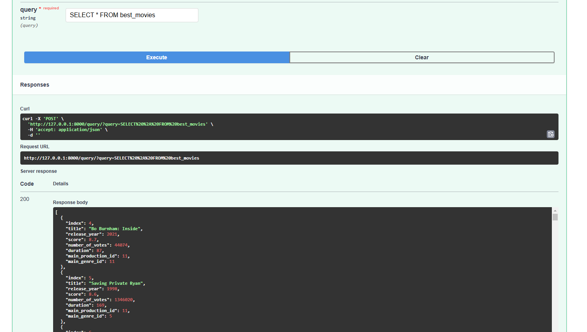

# Netflix_db_setup

The purpose of this project is to manage Netflix library data by employing data cleaning
and normalization processes. Once the data has been cleaned and normalized, it is structured
into tables and uploaded to a PostgreSQL database. These procedures ensure that the data
is systematically organized and ready for further analysis or integration into other applications.
Additionally, there are two options for accessing the data via API: FastAPI and a BASH option.

# Plan:
1. Review raw data in Jupyter Notebook.
2. Create a database and establish the connection.
3. Transform data.
4. Load transformed data to database.
5. Create relationships between tables, normalize database.
6. Load Raw data to the database.
7. Create Python API's to have access to the data using SQL queries.

## Setup Instructions
Follow these steps to set up and run the project:

1. Clone the Repository type`git clone https://github.com/TuringCollegeSubmissions/rgaldi-DE1.v2.4.1` in bash
2. CD to rgaldi-DE1.v2.4.1
3. Set Up Database Connection Settings
4. Create a file named `db_conn_settings.py` in the root directory of the project.
5. Inside this file, define the following variables with your database connection details:
python

### db_conn_settings.py

`DB_USERNAME = "your_database_username"`

`DB_PASSWORD = "your_database_password"`

`DB_HOST = "your_database_host"`

`DB_PORT = "your_database_port"`

`DB_NAME = "your_database_name"`
### Install Dependencies
1. Make sure you have Python and pip installed.
2. Then install the required dependencies: Copy code `pip install -r requirements.txt`
3. Run the `main.py` script to execute the project.
4. Follow the instructions and messages printed to the console for further guidance.

### Normalized DB

### RAW DATA

### API QUERY EXAMPLE
Returns the query result if the first word in the query is `SELECT` otherwise, it returns the message `"Query executed successfully."`
1. TYPE `uvicorn db_api:app --reload` in BASH/TERMINAL

2. Go to `http://127.0.0.1:8000/docs#/`
3. ENTER query and press EXECUTE

4. CTRL+C in BASH/TERMINAL to quit

### BASH API
Returns the query result if the first word in the query is `SELECT` otherwise, it returns the message `"Query executed successfully."`

Enter in BASH/TERMINAL
`python -c "from sequal_queries import terminal_query; terminal_query('enter_query_here;')"`
Change "enter_query_here" with your query

